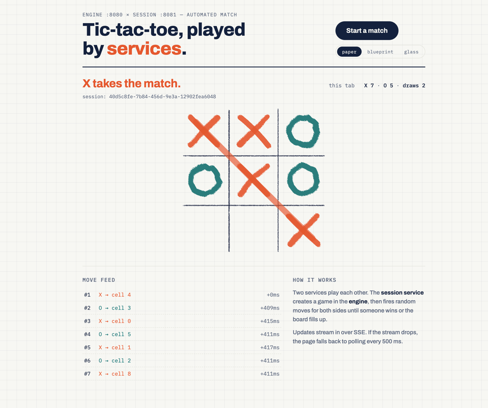
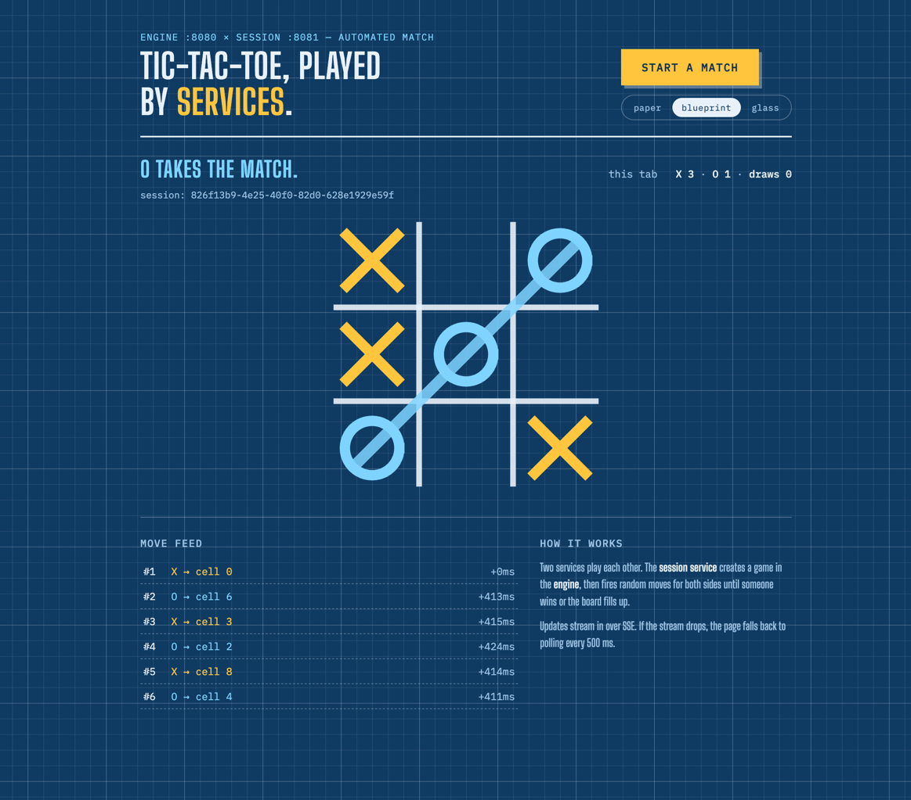
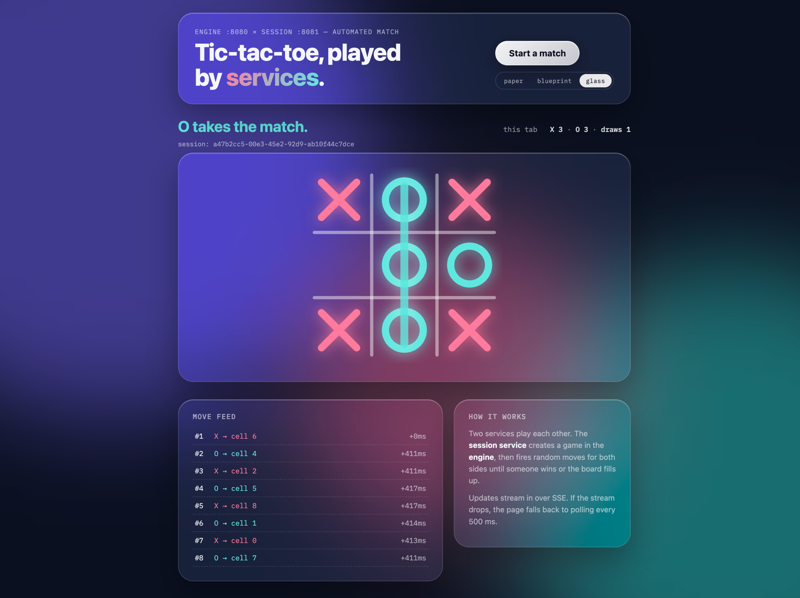

# Distributed Tic Tac Toe Microservices



<details>
<summary>Other UI themes (switchable on the page)</summary>

| Blueprint | Glass |
|---|---|
|  |  |

</details>

## Architecture

```text
Browser UI (session-service static/index.html)
            |
            v
Session Service (:8081) ----REST----> Engine Service (:8080)
```

The Engine Service owns the game rules, move validation and board state. The Session Service creates sessions, runs the asynchronous simulation, caches the board/history for the UI, and forwards moves to the Engine via `RestClient`.

## Run

One command (build, wait for readiness, open the browser):

```bash
./run.sh
```

Or manually:

```bash
docker compose up --build
```

Once started:

- UI: http://localhost:8081
- Engine Swagger UI: http://localhost:8080/swagger-ui/index.html
- Session Swagger UI: http://localhost:8081/swagger-ui/index.html
- Engine health: http://localhost:8080/actuator/health
- Session health: http://localhost:8081/actuator/health

Local run without Docker (two terminals):

```bash
mvn -pl engine-service spring-boot:run
mvn -pl session-service spring-boot:run
```

## API

| Service | Method | Endpoint | Purpose |
|---|---|---|---|
| Engine | POST | `/games/{gameId}` | Create empty game |
| Engine | POST | `/games/{gameId}/move` | Apply move |
| Engine | GET | `/games/{gameId}` | Read game state |
| Session | POST | `/sessions` | Create session and engine game |
| Session | POST | `/sessions/{sessionId}/simulate` | Start async simulation |
| Session | GET | `/sessions/{sessionId}` | Read cached session state |
| Session | GET | `/sessions/{sessionId}/stream` | SSE stream of session updates |

Curl examples:

```bash
curl -X POST http://localhost:8080/games/demo

curl -X POST http://localhost:8080/games/demo/move \
  -H 'Content-Type: application/json' \
  -d '{"player":"X","position":0}'

curl -X POST http://localhost:8081/sessions

curl -X POST http://localhost:8081/sessions/<session-id>/simulate
```

## Tests

```bash
mvn verify
```

Coverage:

- Engine unit: `GameLogicTest` (all 8 winning lines, draw, every invalid-move case)
- Engine concurrency: `GameStoreConcurrencyTest` (32 threads race the same move — exactly one is applied)
- Engine integration: `GameControllerIntegrationTest` (happy path, 404/409/400, ProblemDetail format)
- Session integration: `SessionControllerIntegrationTest` (mocked Engine: full simulation, mid-game failure, 502 on create, repeated simulate)
- End-to-end: `FullGameE2ETest` (real Engine started in test scope, full game via REST)

## Design decisions

**ConcurrentHashMap vs H2.** Game and session state is ephemeral and the assignment explicitly allows in-memory storage, so `ConcurrentHashMap` beats H2 on both complexity and effort. The path to persistence would be PostgreSQL with optimistic locking via a `version` column.

**Concurrency.** The Engine locks per game object inside `ConcurrentHashMap.compute(...)`. This gives atomic updates per game without a global lock; contention is negligible. Verified by `GameStoreConcurrencyTest`: 32 threads submit an identical move simultaneously and exactly one succeeds. Simulations run on virtual threads, so independent games never block each other (smoke-tested with 100 parallel sessions).

**Sync REST instead of an event bus.** For two services, synchronous REST is the simplest and cheapest option. An event-driven architecture only pays off when there is a real need for replay, fan-out, or independent scaling of the move history.

**No Eureka/Gateway.** Two services with a static `ENGINE_URL` make service discovery and a gateway pure overhead. In production they would appear together with multiple instances, auth, and routing policies.

**Real-time updates.** The UI subscribes to SSE (`/sessions/{id}/stream`) and automatically falls back to 500 ms polling if the stream is unavailable. Every simulated move is published to subscribers; a terminal state closes the stream.

**Possible improvements.** Rule-based or minimax strategy instead of random, idempotency keys for the external `move` endpoint, persistent sessions and history, metrics/tracing between the services.